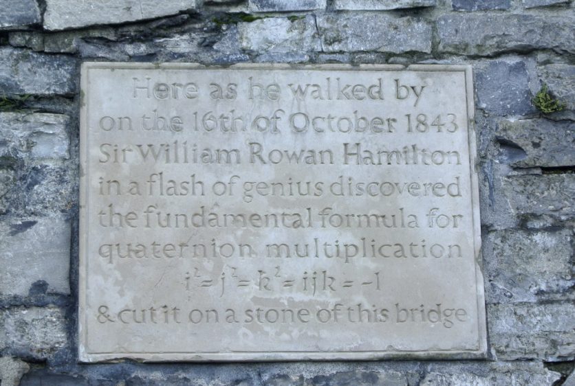
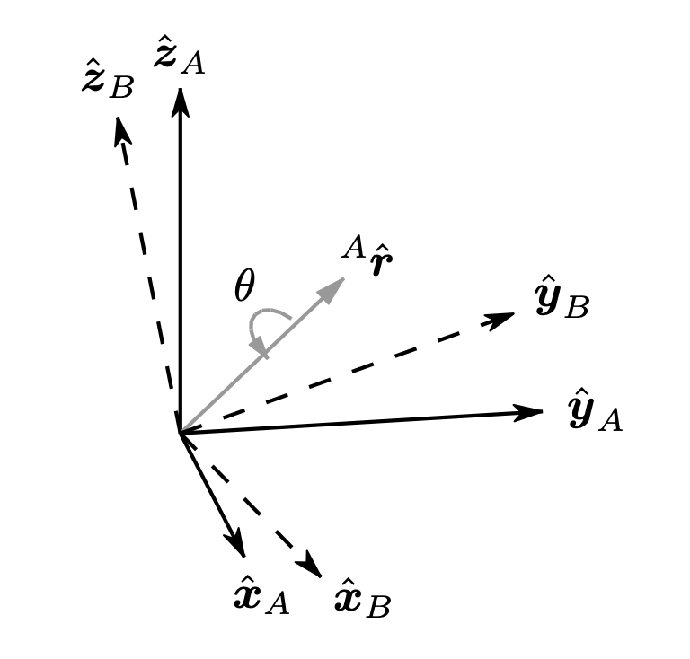
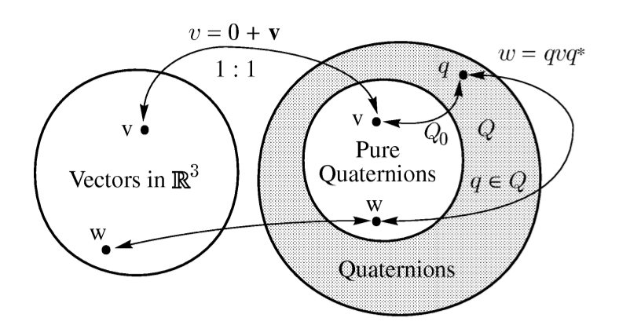
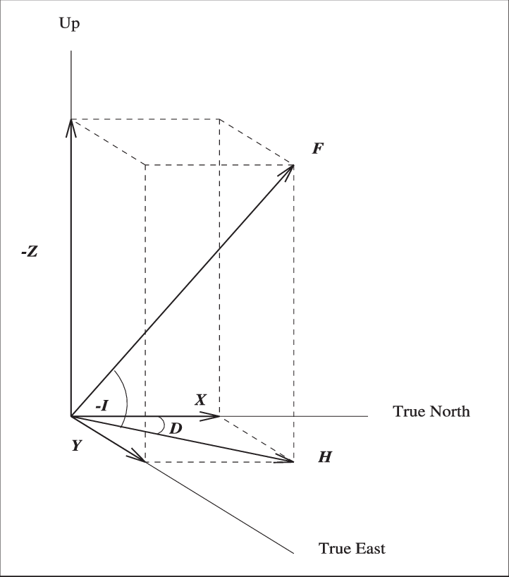
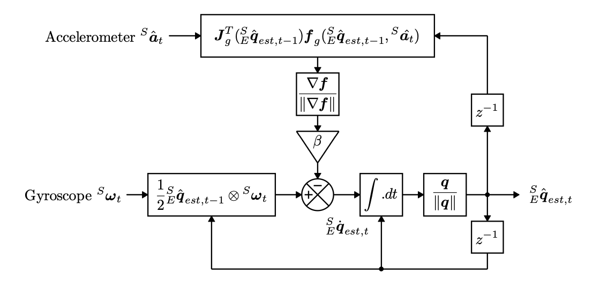
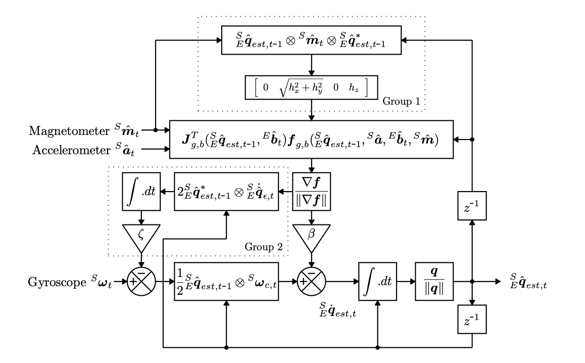

# Navigation using IMU

### Contributors

Mariia Ivanchenko,
Khrystyna Mysak, 
Dzvenyslava Butynets,
Ksenia Kretsula.

## IMU

**I**nertial **M**easurement **U**nit is a specific type of sensor that measures angular rate, force and sometimes magnetic field.

There are many different kinds of IMU devices each containing various measuring tools that pertain to specific uses. For example a 3-axis gyroscope and accelerometer would make up a 6-axis IMU while a 9-axis IMU also contains a 3-axis magnetometer.

**Accelerometers** are one of the most commonly used motion sensors and are used to measure the rate of change in an object's velocity due to linear forces acting upon it.

We can integrate a vehicle's acceleration to calculate velocity and integrate velocity to calculate distance traveled. So using accelerometer data it is possible to calculate distance from a set start point. In order to more accurately determine the position of a vehicle in 3d space **more data types are required**.

Acceleration data alone does not account for turns and non-linear movement that a vehicle makes along its journey. To solve this most IMU devices contain a **gyroscope** which measures angular velocity of three axes roll about the y-axis pitch about the x-axis and yaw about the z-axis. Although gyroscopes have no initial frame of reference like accelerometers when data from both is combined using **sensor fusion** techniques a vehicle's position and orientation can be reliably calculated. Also, the problem for gyroscope is the **zero drift** that has to be compensated for any usable application.

**Magnetometers** are used to measure the strength and direction of a magnetic field. In IMUs, they can provide a point of reference. A magnetometer is mainly used for speed detection and with fusion algorithm it can eliminate the gyroscope offset.

Since IMU does not use known reference points calculations can often contain small errors which in time can add up to larger errors. The **Kalman filtering** that uses only accelerometer and gyroscope, is a relatively simple state-space algorithm to produce estimates of the hidden variables based on uncertain and inaccurate measurements. It predicts the systems future state based on past estimations and is applied to model systems with multiple noisy inputs and outputs hopefully less noisy and more accurately estimated output data.

Other commonly known algorithms are Sebastian Madgwick's fusion algorithm and Mahony's algorithm.

## Microcontroller

In this project we are using RISC Microcontroller: **STM32F411E-DISCO**.

## Components

- LSM303DLHC (mag + acc)
- L3GD20 (gyro)
- UART

## Madgwick filter

This is an orientation filter applicable to IMUs consisting of 3-axial gyroscopes and accelerometers, and MARG (magnetic angular rate and gravity) arrays, which also include 3-axial magnetometers, proposed by Sebastian Madgwick.

The filter employs a quaternion representation of orientation to describe the nature of orientations in three-dimensions and is not subject to the singularities associated with an Euler angle representation, allowing accelerometer and magnetometer data to be used in an analytically derived and optimised gradient-descent algorithm to compute the direction of the gyroscope measurement error as a quaternion derivative.

Innovative aspects of this filter include:

- A single adjustable parameter defined by observable systems characteristics.
- An analytically derived and optimised gradient-descent algorithm enabling performance at low sampling rates.
- On-line magnetic distortion compensation algorithm.
- Gyroscope bias drift compensation.

### Quaternion representation

The foundation of quaternions lies in the principles of the complex number system. Complex numbers are represented in two-dimensional space and are expressed as $a + bi$, where $a$ and $b$ are real numbers, and $i$ is the imaginary unit.

By adding two imaginary numbers to the complex number system in addition to $i$, we can extend this to a 3-dimensional space. This augmentation results in a quaternion, a four-dimensional mathematical entity introduced by William Rowan Hamilton in 1843.

[Link to an article detailing the historical background of the subject.](https://maa.org/sites/default/files/pdf/upload_library/46/HOMSIGMAA/Buchmann.pdf)

The set of quaternions is denoted as $H$, with the general expression:

$$
H = \{a + bi + cj + dk : a, b, c, d ∈ R\} \tag 1
$$

where $a, b, c, d$ are real numbers, and $*i, j, k$ —* imaginary ($i=j=k=\sqrt{-1}$).

According to Hamilton’s famous expression:

$$
i^2=j^2=k^2=ijk=-1 \tag 2
$$

and

$$
\begin{array}{ccc}ij=k & jk=i & ki=j \\ ji=-k & kj=-i & ik=-j\end{array} \tag 3
$$

### Quaternion algebra

In quaternion algebra, commutativity is not applicable $(ab \ne ba)$. However, quaternions follow the associative rule $(ab)c = a(bc)$.

**Rotation from frame A to frame B**

An arbitrary orientation of frame B relative to frame A can be achieved through a rotation of angle $\theta$ around an axis $^A\widehat r$ defined in frame A.

The orientation of frame B is achieved by a rotation, from alignment with frame A, of angle θ around the axis $^A\widehat r$.

The quaternion describing this orientation $^A_B\widehat q$, is defined by the equation:

$$
^A_B\widehat q = [q_1 \ q_2 \ q_3 \ q_4] = [ \cos(\frac{\theta}{2}) \ -r_x\sin(\frac{\theta}{2}) \ -r_y\sin(\frac{\theta}{2}) \ -r_z\sin(\frac{\theta}{2})] \tag 4
$$

where $r_x$, $r_y$ and $r_z$ define the components of the unit vector $^A\widehat r$ in the x, y and z axes of frame A respectively.

Quaternion arithmetic often requires that a quaternion describing an orientation is first normalised. It is therefore conventional for all quaternions describing an orientation to be of unit length.

**Quaternion Conjugate**

The quaternion conjugate, denoted by ∗, can be used to **swap** the relative frames described by an orientation. For example, $^B_A\widehat q$ is the conjugate of $_B^A\widehat q$ and describes the orientation of frame A relative to frame B defined by the equation:

$$
_B^A\widehat q^* = _A^B\widehat q = [q_1 \ -q_2 \ -q_3 \ -q_4] \tag 5
$$

**Quaternion Product**

Denoted by $⊗$, can be used to define compound orientations. For example, for two orientations described by $_B^A\widehat q$ and $_C^B\widehat q$, the compounded orientation $_C^A\widehat q$ can be defined by the equation:

$$
_C^A\widehat q = _C^B\widehat q ⊗ _B^A\widehat q \tag 6
$$

The quaternion product of $a$ and $b$ can be determined using the Hamilton rule and defined as an equation:

$$
a ⊗ b = [a_1 \ a_2 \ a_3 \ a_4] ⊗ [b_1 \ b_2 \ b_3 \ b_4] =
\left[\begin{array}{}
a_1b_1-a_2b_2-a_3b_3-a_4b_4 \\
a_1b_2+a_2b_1+a_3b_4-a_4b_3 \\
a_1b_3-a_2b_4+a_3b_1+a_4b_2 \\
a_1b_4+a_2b_3-a_3b_2+a_4b_1
\end{array}\right] \tag 7
$$

**Quaternion operations on vectors**

A three-dimensional vector can be rotated by a quaternion using the equation:

$$
^Bv = \ _B^A\widehat q ⊗ \ ^Av ⊗ \ _B^A \widehat q^* \tag 8
$$

$^Av$ and $^Bv$ are the same vector described in frame A and frame B respectively where each vector contains a 0 inserted as the first element to make them 4-element row vectors.

The orientation described by $_B^A\widehat q$ can be represented as the rotation matrix $^A_BR$ defined by the equation:

$$
^A_BR =
\left[\begin{array}{}
2q_1^2-1+2q_2^2 & 2(q_2q_3+q_1q_4) & 2(q_2q_4-q_1q_3) \\
2(q_2q_3-q_1q_4) & 2q_1^2-1+2q_3^2 & 2(q_3q_4+q_1q_2) \\
2(q_2q_4+q_1q_3) & 2(q_3q_4-q_1q_2) & 2q_1^2-1+2q_4^2
\end{array}\right] \tag 9
$$

**Euler angles. Roll, pitch and yaw**

Euler angles $\psi$, $\theta$ and $\phi$ in the so-called three-rotation ****aerospace sequence [1] describe an orientation of frame B achieved by the sequential rotations, from alignment with frame A, of

- $\psi$ around $\widehat z_B$ — yaw,
- $\theta$ around $\widehat y_B$ — pitch,
- $\phi$ around $\widehat x_B$ — roll.

This Euler angle representation of $_B^A\widehat q$ is defined by equations:

$$
\psi = Atan2(2q_2q_3 − 2q_1q_4, \ 2q_1^2 + 2q_2^2 − 1) \tag{10}
$$

$$
\theta = −sin^{−1}(2q_2q_4 + 2q_1q_3)  \tag{11}
$$

$$
\phi = Atan2(2q_3q_4 − 2q_1q_2, \ 2q_1^2 + 2q_4^2 − 1) \tag{12}
$$

Quaternions provide a few obvious advantages over using matrices or Euler angles for representing rotations in 3D space.

- Rotation concatenation using quaternions is faster than combining rotations expressed in matrix form.
- For unit-norm quaternions, the inverse of the rotation is taken by subtracting the vector part of the quaternion. Computing the inverse of a rotation matrix is considerably slower if the matrix is not orthonormalized (if it is, then it’s just the transpose of the matrix).
- Converting quaternions to matrices is slightly faster than for Euler angles.
- Quaternions only require 4 numbers to represent a rotation whereas a matrix requires at least 9 values.

### Filter derivation

**Orientation from angular rate**

A tri-axis gyroscope will measure the angular rate of the $x$, $y$ and $z$ axes of the senor frame, termed $\omega_x$, $\omega_y$ and $\omega_z$ respectively. If these parameters (in rads$^{−1}$ representing the reciprocal of radians $\frac{1}{rad}$) are arranged into the vector $^S\omega$ defined by equation:

$$
^S\omega = [0 \ \omega_x \ \omega_y \ \omega_z] \tag{13}
$$

the quaternion derivative describes the rate of change of orientation of the earth frame relative to the sensor frame $^S_E \dot q$ can be calculated [2] as an equation:

$$
^S_E \dot q = \frac{1}{2} \ ^S_E \widehat q \ ⊗ \ ^S\omega \tag{14}
$$

The orientation of the earth frame relative to the sensor frame at the time $t$, $^E_Sq_{ω,t}$, can be computed by numerically integrating the quaternion derivative $_E^S \dot q_{ω,t}$ as described by equations:

$$
_E^S \dot q_{ω,t} = \frac{1}{2} \ ^S_E \widehat q_{est,t-1} \ ⊗ \ ^S\omega_t \tag{15}
$$

$$
_E^S q_{ω,t} = \ ^S_E \widehat q_{est,t-1} + \ _E^S \dot q_{ω,t}\Delta t \tag{16}
$$

provided that initial conditions are known. In these equations, $^S\omega_t$ is the angular rate measured at the time $t$, $\Delta t$ is the sampling period and $^S_E \widehat q_{est,t-1}$ is the previous estimate of orientation. The sub-script $\omega$ indicates that the quaternion is calculated from angular rates.

**Orientation from vector observations**

A tri-axis accelerometer will measure the magnitude and direction of the field of **gravity** in the sensor frame compounded with linear accelerations due to the motion of the sensor.

Similarly, a tri-axis magnetometer will measure the magnitude and direction of the earth’s **magnetic** field in the sensor frame compounded with local magnetic flux and distortions.

In the context of an orientation filter, it will initially be assumed that an accelerometer will measure only gravity, and a magnetometer will measure only the earth’s magnetic field.

Knowing the direction of the Earth's magnetic field in the Earth frame, measuring the field's direction within the sensor frame enables the calculation of the orientation of the sensor frame relative to the Earth frame.

However, for any given measurement there will not be a unique sensor orientation solution, instead, there will be infinite solutions represented by all those orientations achieved by the rotation of the true orientation around an axis parallel with the field.

In some applications, it may be acceptable to use an Euler angle representation allowing an incomplete solution to be found as two known Euler angles (pitch and roll) and one unknown (yaw). The unknown angle is the rotation around an axis parallel to the direction of the field.

A quaternion representation requires a **complete** solution to be found which involves solving an optimization problem. This is achieved by finding the sensor orientation $^S_E \widehat q$ that aligns a known reference **direction of the Earth's magnetic field** ($^E \widehat d$) in the Earth frame with the measured **field direction in the sensor frame** ($^S \widehat s$). The alignment is achieved through a rotation operation expressed by the equation (8).

To simplify, imagine having a sensor, and you want to figure out how it's oriented relative to the Earth's magnetic field. You know the preferred direction of the Earth's field ($^E \widehat d$), and you've measured how the field appears in the sensor's frame ($^S \widehat s$). Now, the challenge is to find the best orientation of the sensor ($^S_E \widehat q$) that makes these two directions align. Thus the goal is to adjust the sensor's orientation until the measured field aligns with the known Earth field direction. This process is a part of optimization algorithms that iteratively refine the quaternion values until the best alignment is achieved, providing an accurate representation of the sensor's orientation to the Earth's magnetic field.

Therefore $^S_E \widehat q$ may be found as the solution to

$$
\min_{^S_E \widehat q \in \ \mathbb{R}^4}f(^S_E \widehat q, ^E \widehat d, ^S \widehat s) \tag{17}
$$

where equation

$$
f(^S_E \widehat q, ^E \widehat d, ^S \widehat s) = \ ^S_E \widehat q^* ⊗ \ ^E \widehat d ⊗ \ ^S_E \widehat q - ^S \widehat s \tag{18}
$$

defines the objective function.

The order of multiplication is swapped to ensure that the conjugate $^S_E \widehat q^*$ performs the inverse rotation operation correctly, aligning the Earth reference direction with the sensor's measurement.

The components of each vector are defined in equations:

$$
^S_E \widehat q = [q_1 \ q_2 \ q_3 \ q_4] \tag{19}
$$

$$
^E \widehat d = [0 \ d_x \ d_y \ d_z] \tag{20}
$$

$$
^S \widehat s = [0 \ s_x \ s_y \ s_z] \tag{21}
$$

Many optimisation algorithms exist but the **gradient descent algorithm** is one of the simplest to both implement and compute. Equation

$$
^S_E q_{k+1}= \ ^S_E \widehat q_{k} - \mu \frac{\nabla f(^S_E \widehat q_k, \ ^E \widehat d, \ ^S \widehat s)}{|| \nabla f(^S_E \widehat q_k, \ ^E \widehat d, \ ^S \widehat s) ||}, \ \ k=0,1,2,...,n \tag{22}
$$

describes the gradient descent algorithm for $n$ iterations resulting in an orientation estimation of $^S_E \widehat q_{n+1}$ based on an ‘initial guess’ orientation $^S_E \widehat q_0$ and a step-size $\mu$.

Equation:

$$
\nabla f(^S_E \widehat q_k, \ ^E \widehat d, \ ^S \widehat s) = J^T(^S_E \widehat q_k, \ ^E \widehat d) \cdot f(^S_E \widehat q_k, \ ^E \widehat d, \ ^S \widehat s) \tag{23}
$$

computes the gradient of the solution surface defined by the objective function and its Jacobian; simplified to the 3-row vectors defined by equations:

$$
f(^S_E \widehat q_k, \ ^E \widehat d, \ ^S \widehat s) = \left[\begin{array}{}
2d_x(\frac{1}{2}-q_3^2-q_4^2) + 2d_y(q_1q_4+q_2q_3) + 2d_z(q_2q_4-q_1q_3) - s_x \\ 2d_x(q_2q_3-q_1q_4) + 2d_y(\frac{1}{2}-q_2^2-q_4^2) + 2d_z(q_1q_2+q_3q_4) - s_y \\
2d_x(q_1q_3+q_2q_4) + 2d_y(q_3q_4-q_1q_2) + 2d_z(\frac{1}{2}-q_2^2-q_3^2) - s_z
\end{array}\right] \tag{24}
$$

$$
J^T(^S_E \widehat q_k, \ ^E \widehat d) = 
\left[\begin{array}{}
2d_yq_4-2d_zq_3 & 2d_yq_3+2d_zq_4 & -4d_xq_3+2d_yq_2-2d_zq_1 & -4d_xq_4+2d_yq_1+2d_zq_2\\

-2d_xq_4+2d_zq_2 & 2d_xq_3-4d_yq_2+2d_zq_1 & 2d_xq_2+2d_zq_4 & -2d_xq_1-4d_yq_4+2d_zq_3\\

2d_xq_3-2d_yq_2 & 2d_xq_4-2d_yq_1-4d_zq_2 & 2d_xq_1+2d_yq_4-4d_zq_3 & 2d_xq_2+2d_yq_3
\end{array}\right] \tag{25}
$$

Equations (22) to (25) describe the general form of the algorithm applicable to a field predefined in any direction. However, if the direction of the field can be assumed to only have components within 1 or 2 of the principle axes of the global coordinate frame then the equations simplify.

An appropriate convention would be to assume that the direction of gravity defines the vertical, z-axis as shown in the equation:

$$
^E \widehat g = [0 \ 0 \ 0 \ 1] \tag{26}
$$

Substituting $^E \widehat g$ and normalised accelerometer measurement:

$$
^S \widehat a = [0 \ a_x \ a_y \ a_z] \tag{27}
$$

for $^E \widehat d$ and $^S \widehat s$ respectively, in equations (24) and (25) yields equations:

$$
f_g(^S_E \widehat q, \ ^S \widehat a) = \left[\begin{array}{}
2(q_2q_4-q_1q_3) - a_x \\ 2(q_1q_2+q_3q_4) - a_y \\
2(\frac{1}{2}-q_2^2-q_3^2) - a_z
\end{array}\right] \tag{28}
$$

$$
J^T_g(^S_E \widehat q) = 
\left[\begin{array}{}
-2q_3 & 2q_4 & -2q_1 & 2q_2\\

2q_2 & 2q_1 & 2q_4 & 2q_3\\

0 & -4q_2 & -4q_3 & 0
\end{array}\right] \tag{29}
$$

The earth’s magnetic field can be considered to have components in one **horizontal** axis and the **vertical** axis (the vertical component due to the inclination of the field which is between 61.1° and 69.1° to the horizontal in the Ukraine [3]).

Components of Earth's magnetic field:

- total field F,
- horizontal component H,
- vertical component Z,
- north component X,
- east component Y,
- declination D,
- inclination I.

This can be represented by equations representing the Earth's magnetic field vector and the normalised magnetic field vector measured by a sensor respectively:

$$
^E \widehat b = [0 \ b_x \ 0 \ b_z] \tag{30}
$$

where $b_x$ is the horizontal component of the Earth's magnetic field, and $b_z$ is the vertical component;

$$
^S \widehat m = [0 \ m_x \ m_y \ m_z] \tag{31}
$$

Substituting $^E \widehat b$ and normalised magnetometer measurement $^S \widehat m$ for $^E \widehat d$ and $^S \widehat s$ respectively, in equations (24) and (25) yields equations:

$$
f_b(^S_E \widehat q, \ ^E \widehat b, \ ^S \widehat m) = \left[\begin{array}{}
2b_x(\frac{1}{2}-q_3^2-q_4^2) + 2b_z(q_2q_4-q_1q_3) - m_x \\ 2b_x(q_2q_3-q_1q_4) + 2b_z(q_1q_2+q_3q_4) - m_y \\
2b_x(q_1q_3+q_2q_4) + 2b_z(\frac{1}{2}-q_2^2-q_3^2) - m_z
\end{array}\right] \tag{32}
$$

$$
J^T_b(^S_E \widehat q, \ ^E \widehat b) = 
\left[\begin{array}{}
-2b_zq_3 & 2b_zq_4 & -4b_xq_3-2b_zq_1 & -4b_xq_4+2b_zq_2\\

-2b_xq_4+2b_zq_2 & 2b_xq_3+2b_zq_1 & 2b_xq_2+2b_zq_4 & -2b_xq_1+2b_zq_3\\

2b_xq_3 & 2b_xq_4-4b_zq_2 & 2b_xq_1-4b_zq_3 & 2b_xq_2
\end{array}\right] \tag{33}
$$

As has already been discussed, the measurement of gravity or the earth’s magnetic field alone will not provide a unique orientation of the sensor. To do so, the measurements and reference directions of both fields may be combined as described by equations:

$$
f_{g,b}(^S_E \widehat q, \ ^S \widehat a, \ ^E \widehat b, \ ^S \widehat m) = \left[\begin{array}{}
f_g(^S_E \widehat q, \ ^S \widehat a) \\
f_b(^S_E \widehat q, \ ^E \widehat b, \ ^S \widehat m)
\end{array}\right] \tag{34}
$$

$$
J^T_{g,b}(^S_E \widehat q, \ ^E \widehat b) = 
\left[\begin{array}{}
J^T_g(^S_E \widehat q) \\
J^T_b(^S_E \widehat q, \ ^E \widehat b)
\end{array}\right] \tag{35}
$$

Whereas the solution surface created by the objective functions in equations (28) and (32) have a minimum defined by a **line**, the solution surface define by equation (34) has a minimum define by a single point, provided that $b_x \ne 0$.

A conventional approach to optimisation would require multiple iterations of equation (22) to be computed for each new orientation and corresponding senor measurements. Efficient algorithms would also require the step-size $\mu$ to be adjusted each iteration to an optimal value; usually obtained based on the second derivative of the objective function, the Hessian matrix (a square matrix of second-order partial derivatives of a scalar-valued function, or scalar field).

However, these requirements considerably increase the computational load of the algorithm and are not necessary in this application. It is acceptable to compute one iteration per time sample provided that the convergence rate governed by $\mu_t$ is equal or greater than the physical rate of change of orientation. Equation:

$$
^S_E q_{\nabla,t}= \ ^S_E \widehat q_{est,t-1} - \mu_t \frac{\nabla f}{|| \nabla f ||} \tag{36}
$$

calculates the estimated orientation $^S_E q_{\nabla,t}$ computed at time $t$ based on a previous estimate of orientation $^S_E \widehat q_{est,t-1}$ and the objective function gradient $\nabla f$ defined by sensor measurements $^S \widehat a_t$ and $^S \widehat m_t$ sampled at time $t$. The subscript $\nabla$ indicates that the quaternion is calculated using the gradient descent algorithm.

The form of $\nabla f$ is chosen according to the sensors in use, as shown in equation:

$$
\nabla f =
\begin{cases}
J^T_g(^S_E \widehat q_{est,t-1}) \cdot f_g(^S_E \widehat q_{est,t-1},  \ ^S \widehat a_t) \\
J^T_{g,b}(^S_E \widehat q_{est,t-1}, \ ^E \widehat b) \cdot f_{g,b}(^S_E \widehat q_{est,t-1}, \ ^S \widehat a, \ ^E \widehat b, \ ^S \widehat m)  \end{cases} \tag{37}
$$

An optimal value of $\mu_t$ can be defined as that which ensures the convergence rate of $^S_E q_{\nabla,t}$ is limited to the physical orientation rate. The goal is to achieve convergence without introducing unnecessary overshooting or instability. Therefore $\mu_t$ can be calculated as equation:

$$
\mu_t = \alpha || ^S_E \dot q_{\omega,t} || \Delta t, \ \ \ \alpha \gt 1 \tag{38}
$$

where $\Delta t$ is the sampling period, $^S_E \dot q_{\omega,t}$ is the physical orientation rate measured by gyroscopes and $\alpha$ is an augmentation of $\mu$ to account for noise in accelerometer and magnetometer measurements.

**Filter fusion algorithm**

An estimated orientation of the sensor frame relative to the earth frame $^S_E q_{est,t}$, is obtained through the fusion of the orientation calculations $^S_E q_{\omega,t}$ and $^S_E q_{\nabla,t}$ calculated previously ((16) and (36)). The fusion of $^S_E q_{\omega,t}$ and $^S_E q_{\nabla,t}$,t is described by equation:

$$
^S_E q_{est,t} = \gamma_t \cdot ^S_E q_{\nabla,t} + (1-\gamma_t) \cdot ^S_E q_{\omega,t}, \ \ \ 0 \le \gamma_t \le 1 \tag{39}
$$

where $\gamma_t$ and $(1 − \gamma_t)$ are weights applied to each orientation calculation. They control the fusion process, allowing for an adaptive and balanced combination of information from multiple sensors for a more robust orientation estimation. $\gamma_t$ represents the level of confidence or trust assigned to the orientation estimate derived from the accelerometer and magnetometer measurements, $(1-\gamma_t)$ — from gyroscope.

An optimal value of $\gamma_t$ can be defined as that which ensures the weighted divergence
of $^S_E q_{\omega,t}$ is equal to the weighted convergence of $^S_E q_{\nabla,t}$. This is represented by equation

$$
(1 - \gamma_t)\beta = \gamma_t \frac{\mu_t}{\Delta t} \tag{40}
$$

where $\frac{\mu_t}{\Delta t}$ is the convergence rate of $^S_E q_{\nabla}$ and $\beta$ is the divergence rate of $^S_E q_{\omega}$ expressed as the magnitude of a quaternion derivative corresponding to the gyroscope measurement error. The equation (40) can be rearranged to define $\gamma_t$ as equation:

$$
\gamma_t = \frac{\beta}{\frac{\mu_t}{\Delta t} + \beta} \tag{41}
$$

Equations (39) and (41) ensure the optimal fusion of $^S_E q_{\omega,t}$ and $^S_E q_{\nabla,t}$ assuming that the convergence rate of $^S_E q_{\nabla}$ governed by $\alpha$ is equal to or greater than the physical rate of change of orientation. Therefore $\alpha$ has no upper bound. If $\alpha$ is assumed to be very large then $\mu_t$, defined by equation (38), also becomes very large and the orientation filter equations simplify. A large value of $\mu_t$ used in equation (36) means that $^S_E q_{est,t-1}$ becomes negligible and the equation can be rewritten as equation:

$$
^S_E q_{\nabla,t} \approx - \mu_t \frac{\nabla f}{|| \nabla f ||} \tag{42}
$$

The definition of $\gamma_t$ in equation (41) also simplifies as the $\beta$ term in the denominator becomes negligible and the equation can be rewritten as equation:

$$
\gamma_t \approx \frac{\beta \Delta t}{\mu_t} \tag{43}
$$

It is possible from equation (43) to also assume that $\gamma_t \approx 0$.

Substituting equations (16), (42) and (43) into equation (39) directly yields equation:

$$
^S_E q_{est,t} = \frac{\beta \Delta t}{\mu_t} \cdot \bigg(- \mu_t \frac{\nabla f}{|| \nabla f ||}\bigg) + (1-\frac{\beta \Delta t}{\mu_t}) \cdot \bigg(\ ^S_E \widehat q_{est,t-1} + \ _E^S \dot q_{ω,t}\Delta t \bigg)
$$

$$
^S_E q_{est,t} = \frac{\beta \Delta t}{\mu_t} \cdot \bigg(- \mu_t \frac{\nabla f}{|| \nabla f ||}\bigg) + (1-0) \cdot \bigg(\ ^S_E \widehat q_{est,t-1} + \ _E^S \dot q_{ω,t}\Delta t \bigg) \tag{44}
$$

It is important to note that in equation (44), $\gamma_t$ has been substituted as both as equation (42) and 0.

Equation (44) can be simplified to equation:

$$
^S_E q_{est,t} = \ ^S_E \widehat q_{est,t-1} + \ ^S_E \dot q_{est,t} \cdot \Delta t \tag{45}
$$

where $^S_E \dot q_{est,t}$ is the estimated rate of change of orientation defined by equation:

$$
^S_E \dot q_{est,t} = \ ^S_E \dot q_{\omega,t} - \beta \cdot ^S_E \dot q_{\epsilon,t} \tag{46}
$$

and $^S_E \dot q_{\epsilon,t}$ is the direction of the error of $^S_E \dot q_{est,t}$ defined by equation:

$$
^S_E \dot q_{\epsilon,t} = \frac{\nabla f}{|| \nabla f ||} \tag{47}
$$

It can be seen from equations (45) to (47) that the filter calculates the orientation $^S_E q_{est}$ by numerically integrating the estimated orientation rate $^S_E \dot q_{est}$. The filter computes $^S_E \dot q_{est}$ as the rate of change of orientation measured by the gyroscope $^S_E \dot q_{\omega}$, with the magnitude of the gyroscope measurement error $\beta$, removed in the direction of the estimated error $^S_E \dot q_{\epsilon}$, computed from accelerometer and magnetometer measurements.

**Block diagram representation of the complete orientation filter implementation for an IMU**

**Magnetic distortion compensation**

Measurements of the earth’s magnetic field will be distorted by the presence of ferromagnetic elements (familiar metals that are noticeably attracted to a magnet, a consequence of their substantial magnetic permeability) in the vicinity of the magnetometer.

These distortions from sources like electrical appliances and metal structures can introduce errors in orientation sensors.

Thus the measured direction of the earth’s magnetic field in the earth frame at time $t$, $^E \widehat h_t$, can be computed as the normalised magnetometer measurement $^S \widehat m_t$, rotated by the estimated orientation of the sensor provided by the filter $^S_E \widehat q_{est,t-1}$; as described by equation:

$$
^E \widehat h_t = [0 \ h_x \ h_y \ h_z] = \ ^S_E \widehat q_{est,t-1} ⊗ \ ^S \widehat m_t ⊗ \ ^S_E \widehat q_{est,t-1}^* \tag{48}
$$

The effect of an erroneous inclination of the measured direction earth’s magnetic field, $^E \widehat h_t$, can be corrected if the filter’s reference direction of the earth’s magnetic field $^E \widehat b_t$, is of the same inclination. This is achieved by computing $^E \widehat b_t$ as $^E \widehat h_t$ normalised to have only components in the earth frame $x$ and $z$ axes; as described by equation:

$$
^E \widehat b_t = [0 \ \sqrt{h_x^2 + h_y^2} \ 0 \ h_z] \tag{49}
$$

Compensating for magnetic distortions in this way ensures that magnetic disturbances are limited to only affect the estimated heading component of orientation. The approach also eliminates the need for the reference direction of the earth’s magnetic field to be predefined.

**Gyroscope bias drift compensation**

The gyroscope zero bias will **drift** over time, with temperature and with motion. Any practical implementation of an IMU or MARG sensor array must account for this. An advantage of Kalman-based approaches is that they are able to estimate the gyroscope bias as an additional state within the system model. However, Mahony showed that gyroscope bias drift may also be compensated for by simpler orientation filters through the integral feedback of the error in the rate of change of orientation. A similar approach will be used here.

The normalised direction of the estimated error in the rate of change of orientation $^S_E \dot {\widehat q}_{\epsilon}$, may be expressed as the angular error in each gyroscope axis using equation:

$$
^S \omega_{\epsilon,t} = 2 \ ^S_E \widehat q_{est,t-1}^* ⊗ \ ^S_E \dot {\widehat q}_{\epsilon} \tag{50}
$$

derived as the inverse to the relationship defined in equation (14). The gyroscope bias $^S \omega_b$, is represented by the DC component (the mean value of the waveform) of $^S \omega_{\epsilon}$ and so may removed as the integral of $^S \omega_{\epsilon}$ weighted by an appropriate gain $\zeta$. This would yield the compensated gyroscope measurements $^S \omega_c$, as shown in equations:

$$
^S \omega_{b,t} = \zeta \sum_t \ ^S \omega_{\epsilon,t} \Delta t \tag{51}
$$

$$
^S \omega_{c,t} = \ ^S \omega_{t} - \ ^S \omega_{b,t} \tag{52}
$$

The first element of $^S \omega_{c}$ is always assumed to be 0.

The compensated gyroscope measurements $^S \omega_{c}$, may then be used in place of the of
the gyroscope measurements $^S \omega$, in equation (14). The magnitude of the angular error in each axis $^S \omega_{\epsilon}$ is equal to a quaternion derivative of unit length. Therefore the integral gain $\zeta$ directly defines the rate of convergence of the estimated gyroscope bias $^S \omega_{b}$, expressed as the magnitude of a quaternion derivative. As this process requires the use of the filter estimate of a **complete** orientation $^S_E \widehat q_{est}$, it is only applicable to a MARG implementation of the filter.

**Block diagram representation of the complete filter implementation for a MARG sensor array, including the magnetic distortion and gyroscope bias drift compensation**

**Filter gains**

The filter gain $\beta$ represents all mean zero gyroscope measurement errors, expressed as the magnitude of a quaternion derivative. The sources of error include:

- sensor noise,
- signal aliasing,
- quantisation errors,
- calibration errors,
- sensor miss-alignment,
- sensor axis non-orthogonality,
- frequency response characteristics.

The filter gain $\zeta$ represents the rate of convergence to remove gyroscope measurement errors which are not mean zero, also expressed as the magnitude of a quaternion derivative. These errors represent the gyroscope bias. It is convenient to define $\beta$ and $\zeta$ using the angular quantities $\omega_{\beta}$ and $\dot \omega_{\zeta}$ respectively, where $\tilde \omega_{\beta}$ represents the estimated mean zero gyroscope measurement error of each axis and $\dot \omega_{\zeta}$ represents the estimated rate of gyroscope bias drift in each axis. Using the relationship described by equation (14), $\beta$ may be defined by equation:

$$
\beta = \bigg|\bigg| \frac{1}{2} \widehat q ⊗ [0 \ \tilde \omega_{\beta} \ \tilde \omega_{\beta} \ \tilde \omega_{\beta}] \bigg|\bigg| = \sqrt{\frac{3}{4}} \ \tilde \omega_{\beta} \tag{53}
$$

where $\widehat q$ is any unit quaternion. Similarly, $\zeta$ may be described by equation:

$$
\zeta = \sqrt{\frac{3}{4}} \ \tilde {\dot \omega}_{\zeta} \tag{54}
$$

### Resources

https://ahrs.readthedocs.io/en/latest/filters/madgwick.html

https://nitinjsanket.github.io/tutorials/attitudeest/mahony.html
